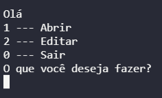
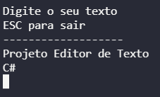
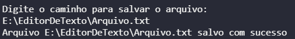
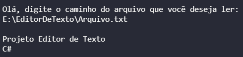

# Editor de Texto

## Objetivos
<li>
<lu> Projeto realizado para estudos</lu>
</li>
 

## Tecnologias utilizadas
<ul>
<li>C#</li>
</ul>

## Funcionalidades

<ul>
<li>Ler arquivos</li>
<li>Criar e salvar arquivos</li>
</ul>

## Exemplos
### Menu
</img>

### Digitando o texto
</img>

### Salvando o arquivo
</img>

### Lendo o arquivo

</img>